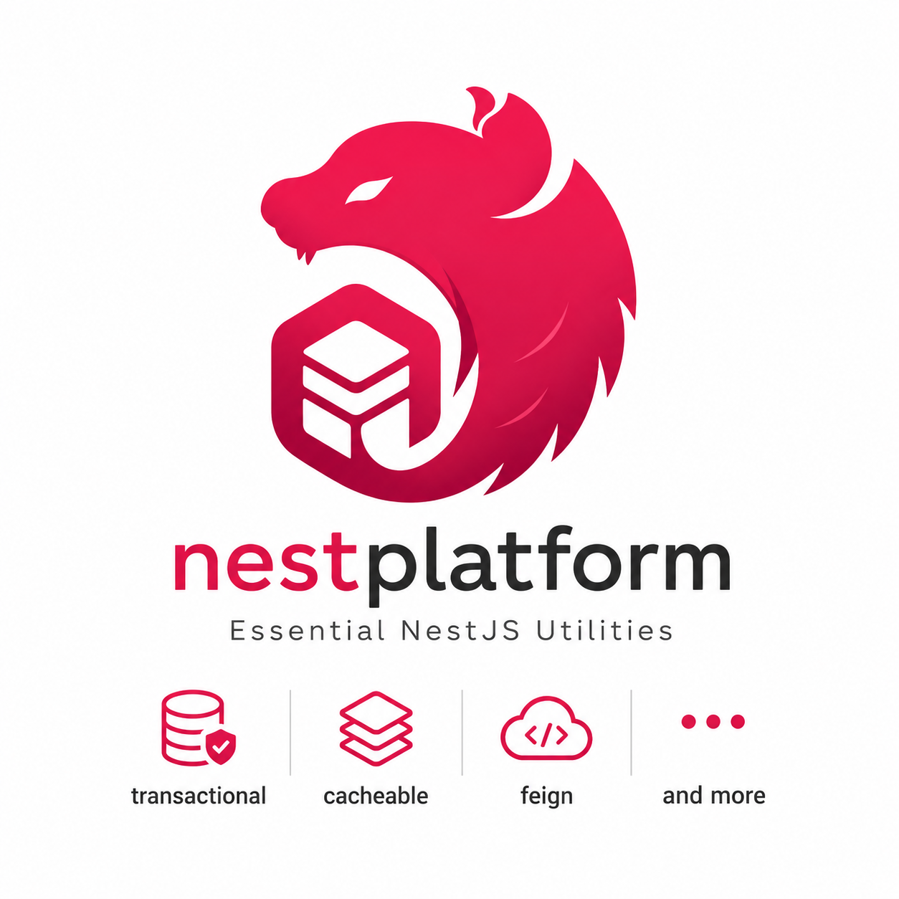

<p align="center">
  <a href="https://github.com/duongtrungnguyenrc/nestplatform">
    
  </a>
</p>

<p align="center">
  NestJS support libraries for transactions, distributed locks, Redis, cache decorators, and declarative HTTP clients.
</p>

<p align="center">
  <a href="https://github.com/duongtrungnguyenrc/nestplatform/actions/workflows/package-compatibility.yml"></a>
  <a href="https://github.com/duongtrungnguyenrc/nestplatform/actions/workflows/npm-release.yml"></a>
  <a href="https://www.npmjs.com/package/@nestplatform/transactional"></a>
  <a href="https://www.npmjs.com/package/@nestplatform/transactional"></a>
  <a href="https://github.com/duongtrungnguyenrc/nestplatform/stargazers"></a>
  <a href="LICENSE"></a>
  = 18" />
</p>

# @nestplatform Monorepo

This monorepo contains a collection of NestJS support libraries focused on high-level application patterns: transaction boundaries, distributed locks, Redis modules, declarative caching, declarative HTTP clients, and shared NestJS utilities.

## Highlights

- **Application-owned integrations**: NestJS, ORM, cache, Redis, PostgreSQL, and reflection packages are declared as peers where applications should control the runtime version.
- **Broad NestJS coverage**: published packages are validated against NestJS 8, 9, 10, and 11. NestJS 12 remains unsupported until it is stable.
- **TypeScript coverage**: CI validates TypeScript 5 and TypeScript 6 compiler lines.
- **Transaction-first runtime checks**: transactional TypeORM and Mongoose behavior is verified with runnable examples and service-backed integration checks.
- **Release-safe publishing**: npm releases support dry runs, provenance, production audit, monorepo build gates, and already-published version skips.

## Packages

| Package                                             | Current | Description                                                                     | Documentation                                                    |
| --------------------------------------------------- | ------- | ------------------------------------------------------------------------------- | ---------------------------------------------------------------- |
| `@nestplatform/common`                              | 1.1.x   | Shared utilities, decorators, and base module helpers.                          | [README](packages/common/README.md)                              |
| `@nestplatform/transactional`                       | 2.0.x   | ORM-agnostic transactional management core for NestJS.                          | [README](packages/transactional/README.md)                       |
| `@nestplatform/transactional-typeorm`               | 2.0.x   | TypeORM adapter for `@nestplatform/transactional`.                              | [README](packages/transactional-typeorm/README.md)               |
| `@nestplatform/transactional-mongoose`              | 2.0.x   | Mongoose adapter for `@nestplatform/transactional`.                             | [README](packages/transactional-mongoose/README.md)              |
| `@nestplatform/transactional-pg`                    | 2.0.x   | PostgreSQL `pg` adapter for `@nestplatform/transactional`.                      | [README](packages/transactional-pg/README.md)                    |
| `@nestplatform/cacheable`                           | 1.1.x   | Spring-like declarative caching decorators for NestJS based on `cache-manager`. | [README](packages/cacheable/README.md)                           |
| `@nestplatform/distribution-lock`                   | 1.1.x   | Shared distributed lock abstractions for NestJS applications.                   | [README](packages/distribution-lock/README.md)                   |
| `@nestplatform/distribution-postgres-advisory-lock` | 1.1.x   | PostgreSQL advisory lock implementation for distributed locks.                  | [README](packages/distribution-postgres-advisory-lock/README.md) |
| `@nestplatform/redis`                               | 1.1.x   | Redis module helpers backed by application-owned `ioredis`.                     | [README](packages/redis/README.md)                               |
| `@nestplatform/distribution-redlock`                | 1.1.x   | Redis Redlock implementation for distributed locks.                             | [README](packages/distribution-redlock/README.md)                |
| `@nestplatform/feign`                               | 1.1.x   | Declarative HTTP client library for NestJS inspired by Spring Cloud OpenFeign.  | [README](packages/feign/README.md)                               |

## Installation

Install only the packages needed by your application. Peer dependencies remain owned by the application so that NestJS, TypeScript, ORM, cache, and infrastructure versions stay aligned with your product.

```bash
npm install @nestplatform/transactional @nestplatform/transactional-typeorm typeorm @nestjs/typeorm
```

```bash
npm install @nestplatform/transactional @nestplatform/transactional-mongoose mongoose @nestjs/mongoose
```

```bash
npm install @nestplatform/transactional @nestplatform/transactional-pg pg
```

```bash
npm install @nestplatform/cacheable @nestjs/cache-manager cache-manager
```

```bash
npm install @nestplatform/redis @nestplatform/distribution-redlock ioredis
```

## Monorepo Management

This project uses **Lerna** and **npm workspaces**.

### Prerequisites

- Node.js >= 18
- npm >= 9

### Getting Started

Install all dependencies:

```bash
npm install
```

Build all packages:

```bash
npm run build
```

Run package compatibility checks locally through the same build targets used by CI:

```bash
npm run build -w @nestplatform/common
npm run build -w @nestplatform/transactional
npm run build -w @nestplatform/transactional-typeorm
npm run build -w @nestplatform/transactional-mongoose
npm run build -w @nestplatform/transactional-pg
```

## CI/CD

| Workflow              | Trigger                                                                           | Purpose                                                                   |
| --------------------- | --------------------------------------------------------------------------------- | ------------------------------------------------------------------------- |
| Package Compatibility | Pull requests and pushes to `main` touching package sources or workspace metadata | Builds published packages across NestJS 8, 9, 10, 11 and TypeScript 5, 6. |
| NPM Release           | Manual dispatch or published GitHub Release                                       | Builds, audits, and publishes public `@nestplatform/*` packages to npm.   |

### Release To NPM

Publishing is handled by the **NPM Release** GitHub Actions workflow.

Required repository secret:

```text
NPM_TOKEN=<npm automation token with publish access to @nestplatform>
```

Release options:

1. Run the workflow manually with `dry_run=true` to verify packaging.
2. Run the workflow manually with `dry_run=false` to publish unpublished package versions.
3. Publish a GitHub Release to trigger the same npm publish flow automatically.

The workflow builds the monorepo, runs a production audit, publishes only packages under `packages/*`, skips versions already available on npm, and uses npm provenance from GitHub Actions.

Release checklist:

1. Confirm package versions and changelog entries.
2. Run the NPM Release workflow with `dry_run=true`.
3. Create or publish the GitHub Release when the dry run is clean.
4. Confirm npm package pages and provenance after publish.

### TypeScript Compatibility

Published packages are validated against TypeScript 5 and TypeScript 6 in GitHub Actions. The transactional examples also run runtime checks against PostgreSQL and MongoDB service containers.

### Supported Versions

Published `@nestplatform/*` libraries declare NestJS packages as peer dependencies. Applications provide their own Nest runtime versions.

| Package                                             | NestJS       | Integration Package                                      | TypeScript |
| --------------------------------------------------- | ------------ | -------------------------------------------------------- | ---------- |
| `@nestplatform/common`                              | 8, 9, 10, 11 | n/a                                                      | 5, 6       |
| `@nestplatform/transactional`                       | 8, 9, 10, 11 | n/a                                                      | 5, 6       |
| `@nestplatform/transactional-typeorm`               | 8, 9, 10, 11 | `@nestjs/typeorm` 9, 10, 11; TypeORM 0.3                 | 5, 6       |
| `@nestplatform/transactional-mongoose`              | 8, 9, 10, 11 | `@nestjs/mongoose` 9, 10, 11; Mongoose 6, 7, 8, 9        | 5, 6       |
| `@nestplatform/transactional-pg`                    | 8, 9, 10, 11 | `pg` 8 peer                                              | 5, 6       |
| `@nestplatform/cacheable`                           | 9, 10, 11    | `@nestjs/cache-manager` 1, 2, 3; `cache-manager` 5, 6, 7 | 5, 6       |
| `@nestplatform/distribution-lock`                   | 8, 9, 10, 11 | n/a                                                      | 5, 6       |
| `@nestplatform/distribution-postgres-advisory-lock` | 8, 9, 10, 11 | `pg` 8 peer                                              | 5, 6       |
| `@nestplatform/redis`                               | 8, 9, 10, 11 | `ioredis` 5 peer                                         | 5, 6       |
| `@nestplatform/distribution-redlock`                | 8, 9, 10, 11 | `ioredis` 5 peer                                         | 5, 6       |
| `@nestplatform/feign`                               | 8, 9, 10, 11 | n/a                                                      | 5, 6       |

NestJS 12 is currently prerelease and is not included in peer ranges yet.

The compatibility matrix is enforced by GitHub Actions for published packages. Transaction examples are pinned runnable apps and use concrete NestJS 11 dependencies.

## Production Notes

- Install peer dependencies explicitly in the application, not through transitive dependencies from this monorepo.
- Keep NestJS package versions aligned across `@nestjs/common`, `@nestjs/core`, and integration packages such as `@nestjs/typeorm`, `@nestjs/mongoose`, or `@nestjs/cache-manager`.
- Use `@nestplatform/transactional` 2.x with the matching 2.x TypeORM, Mongoose, or PG adapter packages.
- Treat distributed locks as infrastructure-sensitive components: configure Redis or PostgreSQL connectivity, retry behavior, and observability according to your deployment model.
- Run the example applications against real PostgreSQL, MongoDB, or Redis services before adopting the matching integration in production.

## Example Projects

There are several example NestJS projects to demonstrate the usage of these libraries:

1. **`example/transactional-typeorm`**: Demonstrates @Transactional with TypeORM.
2. **`example/transactional-mongoose`**: Demonstrates @Transactional with Mongoose.
3. **`example/cacheable`**: Demonstrates declarative caching with @Cacheable, @CachePut, and @CacheEvict.
4. **`example/feign`**: Demonstrates declarative HTTP clients.
5. **`example/rest-client`**: Demonstrates advanced REST client configuration.

To run an example:

1. Build the monorepo: `npm run build`
2. Configure your environment in the example's directory if needed (e.g. `.env`)
3. Start the example: `cd example/<name> && npm run start:dev`

## License

MIT
